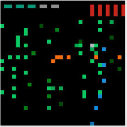

# CSC258-Computer-Organization

This is all my labs and assignments from CSC258H1 S 20211:Computer Organization I took at the University of Toronto.

## Course Description
Computer structures, machine languages, instruction execution, addressing techniques, and digital representation of data. Computer system organization, memory storage devices, and microprogramming. Block diagram circuit realizations of memory, control and arithmetic functions. There are a number of laboratory periods in which students conduct experiments with digital logic circuits.

## Labs - Logism

## Assembly Final Project: Centipede

[Demo Video](https://www.jimschenchen.com/2021/04/16/csc258-assembly-final-project-centipede-demo-video/)

#### Overview
In this project, we will implement a modified version of the popular 1980 Atari game Centipede using MIPS assembly. Familiarize yourself with the game here (https://www.youtube.com/watch?v=V7XEmf02zEM) or here (Flash required; https://my.ign.com/atari/centipede).
Since we don't have access to physical computers with MIPS processors, we will test our implementation in a simulated environment within MARS, i.e., a simulated bitmap display and a simulated keyboard input.

#### Getting Started
1. If you haven’t downloaded it already, get MARS v4.5 [here](https://courses.missouristate.edu/KenVollmar/MARS/download.htm).
2. Open a new file called centipede.s in MARS
3. Set up display: Tools > Bitmap display
 + Set parameters 
    + unit width & height to 8
    + Display Width & height in Pixels to 256
    + base address for display to 0x10008000($bg)
    + Click “Connect to MIPS” once these are set.
4. Set up keyboard: Tools > Keyboard and Display MMIO Simulator
○ Click “Connect to MIPS”
...and then, to run your program:
5. Run > Assemble (see the memory addresses and values, check for bugs)
6. Run > Go (to start the run)
7. Input the character j or k or x in Keyboard area (bottom white box) in Keyboard
and Display MMIO Simulator window

#### Game Feature

1. Milestone 1: Create animations
- [x] Continually repaint the screen with the appropriate assets
- [x] Draw new location of Centipede (10 segments with distinctive head segment, zigzag movement), Bug Blaster, and Mushrooms
- [x] If Centipede is at the bottom of the screen, it continues wriggling and invading the Bug Blaster's personal space
2. Milestone 2: Implement movement controls 
- [x] With keyboard input, move the Bug Blaster along the bottom of the screen
- [x] Shoot out Darts when x is pressed
3. Milestone 3: Basic running version 
- [x] Random Flea movement and initial Mushroom location generator
- [x] Centipede segments turn into mushrooms if shot and "break" if shot in between head and tail.
- [x] Terminate program if Flea intersects a Bug Blaster
- [x] Game over
4. Milestone 4: Game features
- [x] Centipede segments turn into mushrooms if shot and "break" if shot in between head and tail
- [x] Count number of lives (default 5) and display with icons. Terminate game if lives exhausted (Shown at the top right part on the screen)
- [x] Different levels: Add more Mushrooms, more Fleas, longer Centipede length with individually moving segments
- [x] Dynamic increase in difficulty (speed, obstacles, shapes etc.) as game progresses. (Shown at the top left part on the screen)
- [x] Must blast Mushroom 4 times to count as ridding it
5. Milestone 5: Additional features
- [x] Realistic physics: Speed up / slow down Centipede wriggling rate or collision response according to some metric
- [x] Fancier graphics: Make it nicer than the demo
